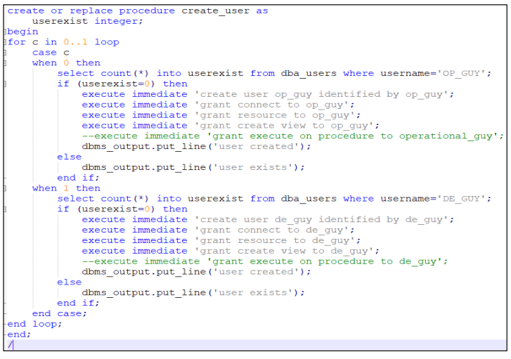
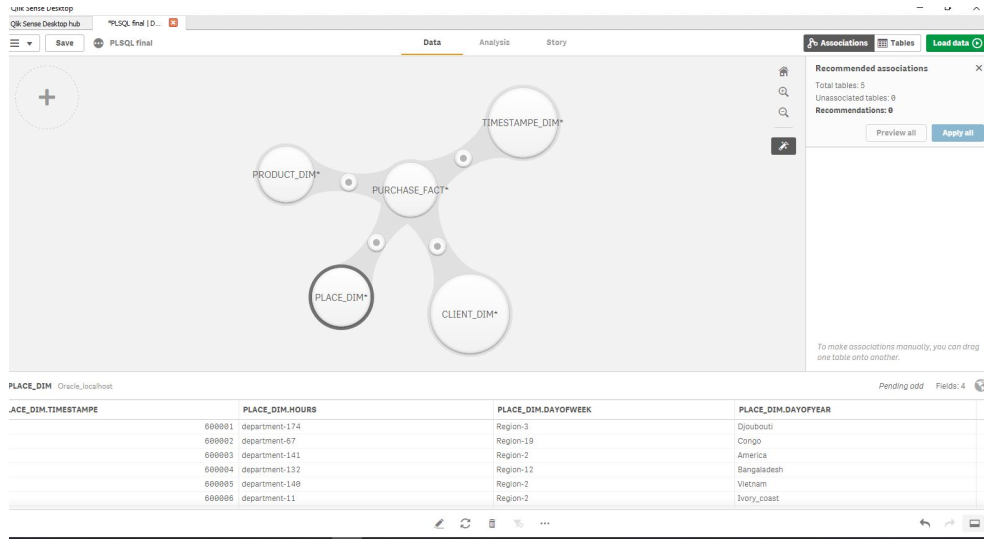
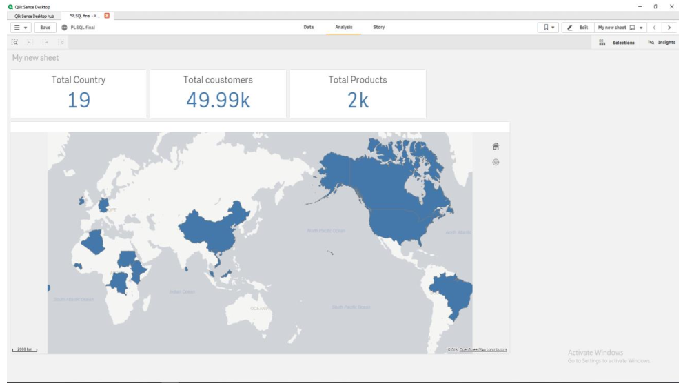

# A4--OLAP-cube-PLSQL-supermarket-dataset

## Introduction:
   Given the supermarket dataset, we intent to develop a OLAP cube from the raw supermarket data and transform the data as tables using PLSQL for further data integration and visualization

## Objective: 
  * To integrate data's such that OLAP cube is formed
  * To master PLSQL language and the concept of OLAP cube
  * Visualize the OLAP cube using QLIKSENSE

## PLSQL code
  To See Full plsql code [click here](https://github.com/induraj2020/A4--OLAP-cube-PLSQL-supermarket-dataset-/blob/master/2019.12.28%20-%20PLSQL.pdf)
  
  screenshot of sample of code:
  

## OLAP Cube visualization in QLIK Sense

  screenshot of sample visualization:
  
  
  
  
  
